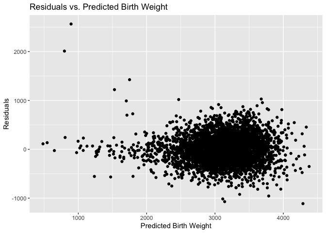

HW6
================
My An Huynh
2024-11-19

``` r
library(tidyverse)
```

    ## ── Attaching core tidyverse packages ──────────────────────── tidyverse 2.0.0 ──
    ## ✔ dplyr     1.1.4     ✔ readr     2.1.5
    ## ✔ forcats   1.0.0     ✔ stringr   1.5.1
    ## ✔ ggplot2   3.5.1     ✔ tibble    3.2.1
    ## ✔ lubridate 1.9.3     ✔ tidyr     1.3.1
    ## ✔ purrr     1.0.2     
    ## ── Conflicts ────────────────────────────────────────── tidyverse_conflicts() ──
    ## ✖ dplyr::filter() masks stats::filter()
    ## ✖ dplyr::lag()    masks stats::lag()
    ## ℹ Use the conflicted package (<http://conflicted.r-lib.org/>) to force all conflicts to become errors

``` r
library(p8105.datasets)
library(modelr)
library(mgcv)
```

    ## Loading required package: nlme
    ## 
    ## Attaching package: 'nlme'
    ## 
    ## The following object is masked from 'package:dplyr':
    ## 
    ##     collapse
    ## 
    ## This is mgcv 1.9-1. For overview type 'help("mgcv-package")'.

``` r
library(SemiPar)
library(GGally)
```

    ## Registered S3 method overwritten by 'GGally':
    ##   method from   
    ##   +.gg   ggplot2

``` r
set.seed(1)
```

## Problem 1

``` r
weather_df = 
  rnoaa::meteo_pull_monitors(
    c("USW00094728"),
    var = c("PRCP", "TMIN", "TMAX"), 
    date_min = "2017-01-01",
    date_max = "2017-12-31") %>%
  mutate(
    name = recode(id, USW00094728 = "CentralPark_NY"),
    tmin = tmin / 10,
    tmax = tmax / 10) %>%
  select(name, id, everything())
```

    ## using cached file: /Users/claudiahuynh/Library/Caches/org.R-project.R/R/rnoaa/noaa_ghcnd/USW00094728.dly

    ## date created (size, mb): 2024-09-26 14:18:13.607687 (8.651)

    ## file min/max dates: 1869-01-01 / 2024-09-30

We’ll focus on a simple linear regression with tmax as the response and
tmin as the predictor, and are interested in the distribution of two
quantities estimated from these data:

𝑟̂ 2 log(𝛽̂ 0∗𝛽̂ 1) Use 5000 bootstrap samples and, for each bootstrap
sample, produce estimates of these two quantities. Plot the distribution
of your estimates, and describe these in words. Using the 5000 bootstrap
estimates, identify the 2.5% and 97.5% quantiles to provide a 95%
confidence interval for 𝑟̂ 2 and log(𝛽̂ 0∗𝛽̂ 1) . Note: broom::glance() is
helpful for extracting 𝑟̂ 2 from a fitted regression, and broom::tidy()
(with some additional wrangling) should help in computing log(𝛽̂ 0∗𝛽̂ 1) .

``` r
set.seed(1)

bootstrap_results =
  weather_df |> 
  modelr::bootstrap(n = 5000) |> 
  mutate(
    models = map(strap, \(x) lm(tmax ~ tmin, data = x)),
    results = map(models, broom::tidy),
    r_squared = map(models, broom::glance)
  ) |> 
  unnest(results) |> 
  select(term, estimate, r_squared) |> 
  pivot_wider(
    names_from = term,
    values_from = estimate
  ) |> 
  rename(
    beta_1 = tmin,
    beta_0 = `(Intercept)`
  ) |> 
   mutate(
    log_beta_product = log(beta_0 * beta_1)
  ) |> 
  unnest(r_squared) |> 
  select(log_beta_product, adj.r.squared)
```

Plot the distribution of these two quantities.

``` r
r_squared_dist = 
  bootstrap_results |> 
  ggplot(aes(x = adj.r.squared)) +
  geom_density() +
  labs(
    title = "Distribution of adjusted R-squared",
    x = "Adjusted R_squared",
    y = "Density"
  )

print(r_squared_dist)
```

<!-- -->

``` r
log_beta_product = 
  bootstrap_results |> 
  ggplot(aes(x = log_beta_product)) +
  geom_density() +
  labs(
    title = "Distribution of log beta products",
    x = "Log (Beta_0 * Beta_1)",
    y = "Density"
  )

print(log_beta_product)
```

<!-- -->

The distributions of these quantities follow normal distribution.

Compute a 95% confidence interval for these two quantities.

``` r
quantiles = 
  bootstrap_results |> 
  summarize(
    r2_0.025 = quantile(adj.r.squared, probs = 0.025),
    r2_0.975 = quantile(adj.r.squared, probs = 0.975),
    log_beta_0.025 = quantile(log_beta_product, probs = 0.025),
    log_beta_0.975 = quantile(log_beta_product, probs = 0.975),
  ) |> 
  mutate(
    r_squared_CI = str_c("(", round(r2_0.025, 3), ",", " ", round(r2_0.975, 3), ")"),
    log_beta_product_CI = str_c("(", round(log_beta_0.025, 3), ",", " ", round(log_beta_0.975, 3), ")")
  ) |> 
  select(r_squared_CI, log_beta_product_CI) |> 
  knitr::kable()

print(quantiles)
```

    ## 
    ## 
    ## |r_squared_CI   |log_beta_product_CI |
    ## |:--------------|:-------------------|
    ## |(0.893, 0.927) |(1.965, 2.059)      |

## Problem 2

``` r
homicide_df =
  read_csv("data/homicide-data.csv") |> 
  mutate(
    city_state = paste(city, state, sep = ", "),
    solved_bin = ifelse(disposition == "Closed by arrest", 1, 0),
    victim_age = as.numeric(victim_age)
  ) |>
  filter(
    !(city_state %in% c("Dallas, TX", "Phoenix, AZ", "Kansas City, MO", "Tulsa, AL")),
    victim_race %in% c("White", "Black")
  ) |> 
  select(-city, -state)
```

    ## Rows: 52179 Columns: 12
    ## ── Column specification ────────────────────────────────────────────────────────
    ## Delimiter: ","
    ## chr (9): uid, victim_last, victim_first, victim_race, victim_age, victim_sex...
    ## dbl (3): reported_date, lat, lon
    ## 
    ## ℹ Use `spec()` to retrieve the full column specification for this data.
    ## ℹ Specify the column types or set `show_col_types = FALSE` to quiet this message.

    ## Warning: There was 1 warning in `mutate()`.
    ## ℹ In argument: `victim_age = as.numeric(victim_age)`.
    ## Caused by warning:
    ## ! NAs introduced by coercion

Glm for Baltimore, MD

``` r
baltimore = 
  homicide_df |> 
  filter(
    city_state == "Baltimore, MD"
  ) 

baltimore_glm = 
  glm(solved_bin ~ victim_age + victim_race + victim_sex, data = baltimore, family = binomial()) |> 
  broom::tidy() |> 
  filter(
    term == "victim_sexMale"
  ) |> 
  mutate(
    odds_ratio = exp(estimate),
    conf_upper_95 = exp(estimate + 1.96 * std.error),
    conf_lower_95 = exp(estimate - 1.96 * std.error)
  )
```

Do this for every city

``` r
glm_function = function(df) {
  df = 
    glm(solved_bin ~ victim_age + victim_race + victim_sex, data = df, family = binomial()) |> 
    broom::tidy() |> 
    filter(
      term == "victim_sexMale"
    ) |> 
    mutate(
      odds_ratio = exp(estimate),
      conf_upper_95 = exp(estimate + 1.96 * std.error),
      conf_lower_95 = exp(estimate - 1.96 * std.error)
    )
}

homicide_glm = 
  homicide_df |> 
  select(city_state, solved_bin, victim_sex, victim_age, victim_race) |>
  nest(data = solved_bin:victim_race) |> 
  mutate(
    glm_results = map(data, glm_function)
  ) |> 
  unnest(glm_results) |> 
  select(city_state, odds_ratio, conf_lower_95, conf_upper_95)

homicide_plot = 
  homicide_glm |> 
  ggplot(aes(x = reorder(city_state, odds_ratio), y = odds_ratio)) +
  geom_point() +
  geom_errorbar(aes(ymin = conf_lower_95, ymax = conf_upper_95)) 

print(homicide_plot)
```

<!-- -->

## Problem 3

``` r
bwt_df = 
  read_csv("data/birthweight.csv") |> 
  janitor::clean_names() |>
  mutate(
    babysex = as.factor(babysex),
    babysex = fct_recode(babysex, "male" = "1", "female" = "2"),
    frace = as.factor(frace),
    frace = fct_recode(
      frace, "white" = "1", "black" = "2", "asian" = "3", 
      "puerto rican" = "4", "other" = "8"),
    malform = as.logical(malform),
    mrace = as.factor(mrace),
    mrace = fct_recode(
      mrace, "white" = "1", "black" = "2", "asian" = "3", 
      "puerto rican" = "4"))
```

    ## Rows: 4342 Columns: 20
    ## ── Column specification ────────────────────────────────────────────────────────
    ## Delimiter: ","
    ## dbl (20): babysex, bhead, blength, bwt, delwt, fincome, frace, gaweeks, malf...
    ## 
    ## ℹ Use `spec()` to retrieve the full column specification for this data.
    ## ℹ Specify the column types or set `show_col_types = FALSE` to quiet this message.

From a biological standpoint, I hypothesize that the following factors
are more likely to underly birthweight: `babysex`, `bhead`, `blength`,
`gaweeks`, `malform`, `smoken`. From a socioeconomical standpoint, I
hypothesize that `frace` and `mrace` may also influence birthweight,
because poverty, education, and employment tend to vary across different
racial and ethnic groups.

#### Create my own model

I will first fit MLR with these variables as predictors.

``` r
linear_model = lm(bwt ~ babysex + bhead + blength + gaweeks + malform + smoken + mrace + frace, data = bwt_df)
summary(linear_model)
```

    ## 
    ## Call:
    ## lm(formula = bwt ~ babysex + bhead + blength + gaweeks + malform + 
    ##     smoken + mrace + frace, data = bwt_df)
    ## 
    ## Residuals:
    ##      Min       1Q   Median       3Q      Max 
    ## -1132.57  -188.95    -7.66   177.72  2441.50 
    ## 
    ## Coefficients:
    ##                     Estimate Std. Error t value Pr(>|t|)    
    ## (Intercept)       -5793.7494   100.4116 -57.700  < 2e-16 ***
    ## babysexfemale        31.6777     8.6273   3.672 0.000244 ***
    ## bhead               135.9928     3.4982  38.875  < 2e-16 ***
    ## blength              78.7602     2.0379  38.649  < 2e-16 ***
    ## gaweeks              12.3073     1.4841   8.293  < 2e-16 ***
    ## malformTRUE          26.4638    72.0362   0.367 0.713362    
    ## smoken               -4.2535     0.5968  -7.127  1.2e-12 ***
    ## mraceblack         -177.9186    46.9074  -3.793 0.000151 ***
    ## mraceasian         -144.4071    73.1152  -1.975 0.048324 *  
    ## mracepuerto rican  -102.4221    45.8186  -2.235 0.025443 *  
    ## fraceblack           40.0528    46.9495   0.853 0.393648    
    ## fraceasian           33.2516    70.6882   0.470 0.638094    
    ## fracepuerto rican   -38.0517    45.5399  -0.836 0.403444    
    ## fraceother           -1.8000    75.5036  -0.024 0.980981    
    ## ---
    ## Signif. codes:  0 '***' 0.001 '**' 0.01 '*' 0.05 '.' 0.1 ' ' 1
    ## 
    ## Residual standard error: 278.2 on 4328 degrees of freedom
    ## Multiple R-squared:  0.7058, Adjusted R-squared:  0.7049 
    ## F-statistic: 798.7 on 13 and 4328 DF,  p-value: < 2.2e-16

The results suggest that all covariates are significant predictors of
birthweight except for `frace` and `malform`. The adjusted R-squared for
this model is 0.7049. I will proceed with refitting the model without
these covariates.

``` r
refitted_linear_model = lm(bwt ~ babysex + bhead + blength + gaweeks + smoken + mrace, data = bwt_df) 

summary(refitted_linear_model)
```

    ## 
    ## Call:
    ## lm(formula = bwt ~ babysex + bhead + blength + gaweeks + smoken + 
    ##     mrace, data = bwt_df)
    ## 
    ## Residuals:
    ##      Min       1Q   Median       3Q      Max 
    ## -1132.16  -187.84    -7.64   177.53  2439.90 
    ## 
    ## Coefficients:
    ##                     Estimate Std. Error t value Pr(>|t|)    
    ## (Intercept)       -5790.9874   100.3077 -57.732  < 2e-16 ***
    ## babysexfemale        31.5609     8.6232   3.660 0.000255 ***
    ## bhead               135.9807     3.4958  38.898  < 2e-16 ***
    ## blength              78.7124     2.0366  38.648  < 2e-16 ***
    ## gaweeks              12.3131     1.4836   8.300  < 2e-16 ***
    ## smoken               -4.2275     0.5957  -7.097 1.48e-12 ***
    ## mraceblack         -138.5887     9.3606 -14.806  < 2e-16 ***
    ## mraceasian         -116.7343    42.9679  -2.717 0.006618 ** 
    ## mracepuerto rican  -136.9243    19.0024  -7.206 6.78e-13 ***
    ## ---
    ## Signif. codes:  0 '***' 0.001 '**' 0.01 '*' 0.05 '.' 0.1 ' ' 1
    ## 
    ## Residual standard error: 278.1 on 4333 degrees of freedom
    ## Multiple R-squared:  0.7056, Adjusted R-squared:  0.7051 
    ## F-statistic:  1298 on 8 and 4333 DF,  p-value: < 2.2e-16

The refitted model now shows an adjusted R-squared of 0.7051. This
suggests that the refitted model does a slightly better job at
explaining the variation in birthweight compared to the original model.

I am also interested in looking at interactions between different
covariates. I will use `ggpairs` to look at multicollinearity between
the continuous variables in my model.

``` r
ggpairs(bwt_df[, c("bhead", "blength", "smoken", "gaweeks")])
```

<!-- -->

Results from ggpairs suggest that `blength` has a moderate linear
relationship with `bhead` (corr = 0.630), `gaweeks` has a moderately
weak relationship with `blength` (corr = 0.359) and `bhead` (corr =
0.378). I will fit another model that includes the three-way interaction
between these covariates.

``` r
interaction_model = lm(bwt ~ babysex + bhead * blength * gaweeks + smoken + mrace, data = bwt_df)
summary(interaction_model)
```

    ## 
    ## Call:
    ## lm(formula = bwt ~ babysex + bhead * blength * gaweeks + smoken + 
    ##     mrace, data = bwt_df)
    ## 
    ## Residuals:
    ##      Min       1Q   Median       3Q      Max 
    ## -1112.18  -186.77    -7.88   178.90  2564.77 
    ## 
    ## Coefficients:
    ##                         Estimate Std. Error t value Pr(>|t|)    
    ## (Intercept)            1.531e+04  4.509e+03   3.395 0.000691 ***
    ## babysexfemale          3.319e+01  8.623e+00   3.849 0.000120 ***
    ## bhead                 -5.581e+02  1.458e+02  -3.828 0.000131 ***
    ## blength               -4.138e+02  1.036e+02  -3.994 6.60e-05 ***
    ## gaweeks               -4.598e+02  1.322e+02  -3.478 0.000510 ***
    ## smoken                -4.127e+00  5.944e-01  -6.944 4.39e-12 ***
    ## mraceblack            -1.370e+02  9.357e+00 -14.638  < 2e-16 ***
    ## mraceasian            -1.143e+02  4.283e+01  -2.668 0.007649 ** 
    ## mracepuerto rican     -1.397e+02  1.896e+01  -7.367 2.07e-13 ***
    ## bhead:blength          1.597e+01  3.167e+00   5.044 4.75e-07 ***
    ## bhead:gaweeks          1.569e+01  4.149e+00   3.781 0.000158 ***
    ## blength:gaweeks        1.116e+01  2.900e+00   3.848 0.000121 ***
    ## bhead:blength:gaweeks -3.647e-01  8.741e-02  -4.172 3.07e-05 ***
    ## ---
    ## Signif. codes:  0 '***' 0.001 '**' 0.01 '*' 0.05 '.' 0.1 ' ' 1
    ## 
    ## Residual standard error: 277.1 on 4329 degrees of freedom
    ## Multiple R-squared:  0.708,  Adjusted R-squared:  0.7072 
    ## F-statistic: 874.9 on 12 and 4329 DF,  p-value: < 2.2e-16

``` r
AIC(interaction_model)
```

    ## [1] 61179.68

``` r
AIC(refitted_linear_model)
```

    ## [1] 61207.19

Results from interaction model suggest that all covariates are
significant predictors of birthweight, and that the interactions between
`gaweek`, `bhead` and `blength` are also significant (p-values are all
lower than 0.05). The adjusted R-squared for this model is 0.7072, which
suggests that this model is slightly better than the refitted linear
model without interaction terms.

I also investigated AIC values to evaluate goodness-of-fit of these two
models, and found that the AIC value for the interaction model is
slightly lower than that for the refitted linear model. Based on
adjusted R-squared and AIC value, the interaction model will be my final
model.

The plot showing predictions against residuals is as follows:

``` r
bwt_plot = 
  bwt_df |> 
  add_predictions(interaction_model) |> 
  add_residuals(interaction_model) |> 
  ggplot(aes(x = pred, y = resid)) +
  geom_point() +
  geom_smooth(method = "lm", se = FALSE,  color = "red") +
  labs(
    title = "Residuals vs. Predicted Birth Weight", x = "Predicted Birth Weight", y = "Residuals"
  )

print(bwt_plot)
```

    ## `geom_smooth()` using formula = 'y ~ x'

<!-- -->

The residual aginst prediction plot shows that there is an overall
random scatter pattern, but the model does a better job at explaining
variation in birth weight for birth weight values ranging from 2500 to
3500 grams, which is the typical birth weight for newborn babies. There
are a few extreme data points around the range 500 to 1500, but this
makes biological sense due to factors such as premature birth or
maternal health conditions.

#### Compare this model with other models.

The first model, named `model1`, fits a MLR of `bwt` against `blength`
and `gaweeks` as predictors. The second model, named `model2`, fits a
MLR of `bwt` against `bhead`, `blength` and `babysex` including their
three-way interaction.

``` r
model1 = lm(bwt ~ blength + gaweeks, data = bwt_df)
summary(model1)
```

    ## 
    ## Call:
    ## lm(formula = bwt ~ blength + gaweeks, data = bwt_df)
    ## 
    ## Residuals:
    ##     Min      1Q  Median      3Q     Max 
    ## -1709.6  -215.4   -11.4   208.2  4188.8 
    ## 
    ## Coefficients:
    ##              Estimate Std. Error t value Pr(>|t|)    
    ## (Intercept) -4347.667     97.958  -44.38   <2e-16 ***
    ## blength       128.556      1.990   64.60   <2e-16 ***
    ## gaweeks        27.047      1.718   15.74   <2e-16 ***
    ## ---
    ## Signif. codes:  0 '***' 0.001 '**' 0.01 '*' 0.05 '.' 0.1 ' ' 1
    ## 
    ## Residual standard error: 333.2 on 4339 degrees of freedom
    ## Multiple R-squared:  0.5769, Adjusted R-squared:  0.5767 
    ## F-statistic:  2958 on 2 and 4339 DF,  p-value: < 2.2e-16

``` r
model2 = lm(bwt ~ bhead * blength * babysex, data = bwt_df)
summary(model2)
```

    ## 
    ## Call:
    ## lm(formula = bwt ~ bhead * blength * babysex, data = bwt_df)
    ## 
    ## Residuals:
    ##      Min       1Q   Median       3Q      Max 
    ## -1132.99  -190.42   -10.33   178.63  2617.96 
    ## 
    ## Coefficients:
    ##                               Estimate Std. Error t value Pr(>|t|)    
    ## (Intercept)                 -7176.8170  1264.8397  -5.674 1.49e-08 ***
    ## bhead                         181.7956    38.0542   4.777 1.84e-06 ***
    ## blength                       102.1269    26.2118   3.896 9.92e-05 ***
    ## babysexfemale                6374.8684  1677.7669   3.800 0.000147 ***
    ## bhead:blength                  -0.5536     0.7802  -0.710 0.478012    
    ## bhead:babysexfemale          -198.3932    51.0917  -3.883 0.000105 ***
    ## blength:babysexfemale        -123.7729    35.1185  -3.524 0.000429 ***
    ## bhead:blength:babysexfemale     3.8781     1.0566   3.670 0.000245 ***
    ## ---
    ## Signif. codes:  0 '***' 0.001 '**' 0.01 '*' 0.05 '.' 0.1 ' ' 1
    ## 
    ## Residual standard error: 287.7 on 4334 degrees of freedom
    ## Multiple R-squared:  0.6849, Adjusted R-squared:  0.6844 
    ## F-statistic:  1346 on 7 and 4334 DF,  p-value: < 2.2e-16

Model 1 results show that both variables `blength` and `gaweeks` are
significant predictors of birthweight, with both p-values being less
than 2e-16.

Model 2 results show that `bhead`, `blength` and `babysex` are all
significant predictors of `bwt`. Based on interaction terms, those terms
involving sex (`babysexfemale`) and the main predictors (`bhead`,
`blength`) suggest that the effects of these variables on birthweight
differ between male and female babies. Specifically, the three-way
interaction (bhead:blength:babysexfemale) suggests that the effect of
both head circumference and length at birth on birthweight is further
modified by the baby’s sex. This indicates that the relationship between
`bwt` and main predictors `bhead` and `blength` are not the same for
male and female babies.

I will use `crossv_mc` to make comparisons between my model and the
other models in terms of cross-validated prediction error.

``` r
cv_df = 
  crossv_mc(bwt_df, 100) |> 
  mutate(
    train = map(train, as_tibble),
    test = map(test, as_tibble)
  )

cv_results_df = 
  cv_df |> 
  mutate(
    my_model = map(train, \(x) lm(bwt ~ babysex + bhead * blength * gaweeks + smoken + mrace, data = x)),
    model1 = map(train, \(x) lm(bwt ~ blength + gaweeks, data = x)), 
    model2 = map(train, \(x) lm(bwt ~ bhead * blength * babysex, data = x))
  ) |> 
  mutate(
    rmse_my_model = map2_dbl(my_model, test, rmse),
    rmse_model1 = map2_dbl(model1, test, rmse),
    rmse_model2 = map2_dbl(model2, test, rmse)
  ) |> 
  select(rmse_my_model, rmse_model1, rmse_model2)
```

Compare RMSE for three models.

``` r
cv_results_df |> 
  select(starts_with("rmse")) |> 
  pivot_longer(
    everything(),
    names_to = "model",
    values_to = "rmse",
    names_prefix = ("rmse_")
  ) |> 
  ggplot(aes(x = model, y = rmse)) +
  geom_violin() +
  labs(
    title = "RMSE for 3 models", 
    x = "Model",
    y = "RMSE"
  )
```

<!-- -->
